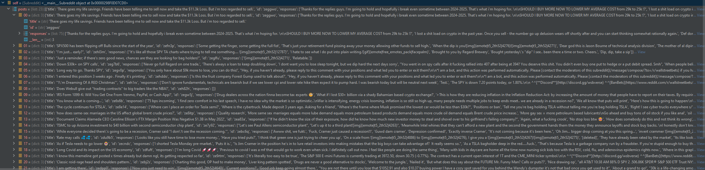
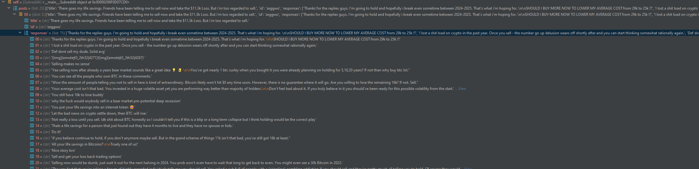
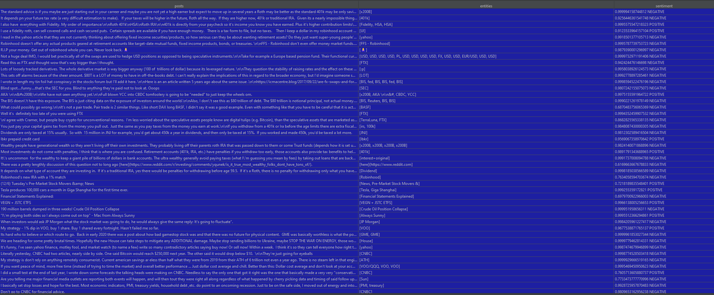

# Overview
This project provides a suite of tools to retrieve trending news and social media posts along with mechanisms to extract relevant entities from this text to perform sentiment analysis. Consult the sections below for descriptions of the included tools, use cases and instructions for setup and operation.

## Setup
It's highly recommended to use a Python virtual environment, either via `python3 -m venv venv` or an external tool such as `pyenv` where you can control the Python version within the virtual environment as well.
Recommended Python version: `3.9+`
Start by installing the requirements, via `pip install -r requirements.txt`

## Trending Reddit Stock Sentiment
This tool uses Reddit APIs along with Python lib `praw` to fetch all the trending posts and responses in each of the posts from popular stock/investment subreddits (wallstreetbets, stocks, investing by default). 
This text is stored in a Pandas dataframe. NLP is performed on the dataframe using `spacy` using the `en_core_web_sm` model. NER is performed and filtering is performed to 
leave only stock symbols, company names and other potential investment targets. Finally the NLP library `flair` is used to generate a sentiment score for each post. 

The intended purpose of this tool is to allow users to pick up the latest sentiments on popular investment entities based on trending Reddit activity. 

### Requirements
- Development and testing was done with Python 3.9
- A Reddit user account is required
- A registered Reddit application is needed to get a client_id and client_secret.[See Reddit App Documentation](https://www.reddit.com/prefs/apps) 
- Install Python libraries flair, spacy, pandas and praw
- Install spacy model en_core_web_sm using `python -m spacy download en_core_web_sm`

### Usage
Consult `get_trending_stock_sentiment.py` and view the `main` function for an example of how to use this tool. 

### Example Output
Using the public Reddit APIs to fetch rising/trending Reddit posts on popular investment subreddits:

Using `praw` to fetch reddit comments to the previously retrieved rising posts

A Pandas DataFrame with Reddit posts, extracted NERs and sentiments after processing with `spacy` and `flair`

### Known Issues
NLP is difficult and social media posts contain a great deal of word level and syntactic ambiguity. Often times the predicted sentiment will not actually apply to the extracted entity because the
input text is actually not referring to the detected entity. There are many other ways that ambiguity invalidates the results of our tool. Additionally, the processing of raw social media posts present 
a significant data cleaning problem. This issue also complicates the task of named entity recognition. It is difficult to avoid picking up non-relevant terms as investment entities. 

## Google News Sentiment Plus Stock Returns

